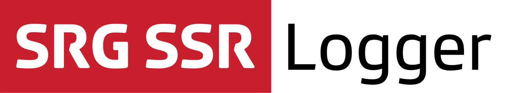

[](https://github.com/Carthage/Carthage) 

## About

The SRG Logger library for iOS provides a simple way to unify logging between SRG SSR libraries and applications, but can be used by any other application or library as well.

Five logging levels are available, which should match most needs:

* `Verbose` for detailed technical information.
* `Debug` for debugging information.
* `Info` for information that may be helpful for troubleshooting errors.
* `Warning` for information about conditions which might lead to a failure.
* `Error` for information about failures.

The library automatically bridges with standard logging frameworks, in the following order:

* If your project uses [CocoaLumberjack](https://github.com/CocoaLumberjack/CocoaLumberjack), messages will be forwarded to it.
* If your project can use [Apple unified logging](https://developer.apple.com/reference/os/1891852-logging), available starting from iOS 10, messages will be forwarded to the system console.

If neither is available, no logging will take place. You can install a verbose `NSLog` based logger, provided as well, if you need a quick way to setup logging (this logger logs all messages and can slow down your application).

The library does not provide any logging to [NSLogger](https://github.com/fpillet/NSLogger). You can namely automatically bridge CocoaLumberjack into NSLogger using [Cédric Luthi's interface](https://github.com/0xced/XCDLumberjackNSLogger) between them.

## Compatibility

The library is suitable for applications running on iOS 8 and above. The project is meant to be opened with the latest Xcode version (currently Xcode 8).

## Installation

The library can be added to a project using [Carthage](https://github.com/Carthage/Carthage)  by adding the following dependency to your `Cartfile`:
    
```
github "SRGSSR/srglogger-ios"
```

Then run `carthage update` to update the dependencies. You will need to manually add the `SRGLogger.framework` generated in the `Carthage/Build/iOS` folder to your projet. If your project needs to the logger from Swift source files, add `SRGLogger_Swift.framework` as well.

For more information about Carthage and its use, refer to the [official documentation](https://github.com/Carthage/Carthage).

## Usage

When you want to use classes or functions provided by the library in your code, you must import it from your source files first.

### Usage from Objective-C source files

Import the global header file using:

```objective-c
#import <SRGLogger/SRGLogger.h>
```

or directly import the module itself:

```objective-c
@import SRGLogger;
```

### Usage from Swift source files

Import the modules where needed:

```swift
import SRGLogger
import SRGLogger_Swift
```

### Logging messages

To log a message, simply call the macro corresponding to the desired level, for example in Objective-C:

```objective-c
SRGLogInfo(@"com.myapp", @"Weather", @"The temperature is %@", @(temperature));
```

or in Swift:

```Swift
SRGLogInfo(subsystem: "com.myapp", category: "Weather", message: "The temperature is \(temperature)")
```

In Objective-C, `SRGLogger.framework` declares the required macros for logging at all supported levels. Since macros are not available in Swift, a companion framework declares equivalent functions for use from Swift source files.

You can provide two optional arguments when logging a message:

* A subsystem, here `com.myapp`, which identifies the library or application you log from.
* A category, here `Weather`, which identifies which part of the code the log is related to.

To avoid specifiying the subsystem in your application or library each time you call the macro, you can define your own set of helpers which always set this value consistently, for example macros in Objective-C:

```objective-c
#define MyAppLogVerbose(category, format, ...) SRGLogVerbose(@"com.myapp", category, format, ##__VA_ARGS__)
#define MyAppLogDebug(category, format, ...)   SRGLogDebug(@"com.myapp", category, format, ##__VA_ARGS__)
#define MyAppLogInfo(category, format, ...)    SRGLogInfo(@"com.myapp", category, format, ##__VA_ARGS__)
#define MyAppLogWarning(category, format, ...) SRGLogWarning(@"com.myapp", category, format, ##__VA_ARGS__)
#define MyAppLogError(category, format, ...)   SRGLogError(@"com.myapp", category, format, ##__VA_ARGS__)
```

or functions in Swift:

```swift
func MyAppLogVerbose(category : String?, message: String, file: String = #file, function: String = #function, line: UInt = #line) {
    SRGLogVerbose(subsystem: "com.myapp", category: category, message: message, file: file, function: function, line: line);
}

func MyAppLogDebug(category : String?, message: String, file: String = #file, function: String = #function, line: UInt = #line) {
    SRGLogDebug(subsystem: "com.myapp", category: category, message: message, file: file, function: function, line: line);
}

func MyAppLogInfo(category : String?, message: String, file: String = #file, function: String = #function, line: UInt = #line) {
    SRGLogInfo(subsystem: "com.myapp", category: category, message: message, file: file, function: function, line: line);
}

func MyAppLogWarning(category : String?, message: String, file: String = #file, function: String = #function, line: UInt = #line) {
    SRGLogWarning(subsystem: "com.myapp", category: category, message: message, file: file, function: function, line: line);
}

func MyAppLogError(category : String?, message: String, file: String = #file, function: String = #function, line: UInt = #line) {
    SRGLogError(subsystem: "com.myapp", category: category, message: message, file: file, function: function, line: line);
}
```

### Interfacing with other loggers

If the default log handler does not suit your needs (or if you simply want to inhibit logging), call the `+setLogHandler` method to set a new handler (or `nil`). Then implement the handler block to forward the messages and contextual information to your other logger. In Objective-C:

```objective-c
[SRGLogger setLogHandler:^(NSString * _Nonnull (^ _Nonnull message)(void), SRGLogLevel level, NSString *const  _Nullable subsystem, NSString *const  _Nullable category, const char * _Nonnull file, const char * _Nonnull function, NSUInteger line) {
    // Foward information to another logger
}];
```

or in Swift:

```swift
SRGLogger.setLogHandler { (message, level, subsystem, category, file, function, line) in
    // Foward information to another logger
}
```

## Apple unified logging troubleshooting

If you are using Apple unified logging and do not see the logs:

1. Check that the scheme you use does not have the `OS_ACTIVITY_MODE` environment variable set to `disable`, or `OS_ACTIVITY_DT_MODE` set to `NO`.
1. If you do not see lower level logs in the `Console.app`, ensure that the items _Include Info Messages_ and `Include Debug Messages` are checked in the console `Action` menu. If these options are grayed out, try updating the logging configuration for your subsystem first by running the following command from a terminal:

	```
	$ sudo log config --mode "level:debug" --subsystem <subsystem>
	```
	
1. Use the search to locate entries for your application name, and right-click on an entry to filter by application, subsystem or category
1. Read the [official documentation](https://developer.apple.com/reference/os/1891852-logging) if you still have issues

## Credits

This logger implementation is heavily based on [a Cédric Luthi's Stack Overflow post](http://stackoverflow.com/questions/34732814/how-should-i-handle-logs-in-an-objective-c-library/34732815#).

## License

See the [LICENSE](LICENSE) file for more information.


